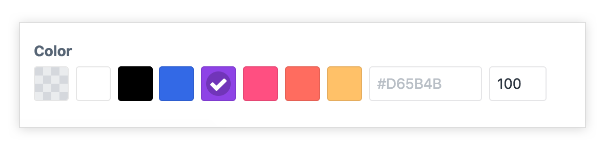
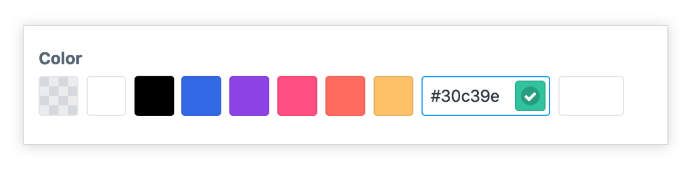
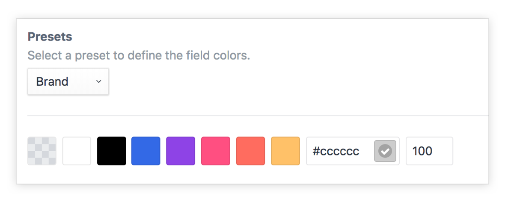

<p align="left"><a href="https://github.com/presseddigital/colorit" target="_blank"></a></p>

# Colorit plugin for Craft CMS 3

A slick color picker fieldtype plugin for the Craft CMS 3 control panel. [That's a mouthful](https://www.youtube.com/watch?v=uFj5_2gk0rA).

This fieldtype plugin gives your content editors a simple tool for selecting from a color palette. Colorit also lets you create custom presets that can be selected when creating colorit fields.

> :loudspeaker: **A note from the new (well sort of new) owners Pressed Digital:**: At the end of 2019 Fruit Studios Ltd was sold to allow it's founders to shift 100% of their focus to the, now not so side project, findarace.com. As a part of the deal we retained ownership of all Craft plugins and are committed to make them even more awesome, with findarace.com being all Craft, this aligns really nicely. As a little silver lining we should now finally have some time to launch some of our unreleased plugins!

## Requirements

This plugin requires Craft CMS 3.0.0, or later.

## Installation

### Plugin Store

Log into your control panel, hit up the 'Plugin Store', search for this plugin and install.

### Composer

Open terminal, go to your Craft project folder and use composer to load this plugin. Once loaded you can install via the Craft Control Panel, go to Settings → Plugins, locate the plugin and hit “Install”.

```bash
cd /path/to/project
composer require presseddigital/colorit
```

## In Use

Select a color from the palette.

<p align="left"></a></p>

Get a live preview when setting opacity.

<p align="left"></a></p>

Define a custom color.

<p align="left"></a></p>


## Templating

Each Colorit fieldtype returns a Color model.

```php
{{ entry.myColoritFieldName }}                - (string)  // Color in format as per field settings)
{{ entry.myColoritFieldName.color }}          - (string)  // Returns the color
{{ entry.myColoritFieldName.color(format) }}  - (string)  // Optional format (hex, rgb, rgba)
{{ entry.myColoritFieldName.opacity }}        - (integer) // The opacity value
{{ entry.myColoritFieldName.handle }}         - (string)  // The color handle
{{ entry.myColoritFieldName.isCustomColor }}  - (bool)    // Is this a custom colour
{{ entry.myColoritFieldName.isTransparent }}  - (bool)    // Is this transparent
{{ entry.myColoritFieldName.hasColor }}       - (bool)    // Does the field have a color set
{{ entry.myColoritFieldName.palette }}        - (array)   // All available colours in the palette
{{ entry.myColoritFieldName.hex }}            - (string)  // Get the hex value
{{ entry.myColoritFieldName.rgb }}            - (string)  // Get the rgb value
{{ entry.myColoritFieldName.rgba }}           - (string)  // Get the rgba value

{{ entry.myColoritFieldName.r }}              - (string) // Get the red value
{{ entry.myColoritFieldName.g }}              - (string) // Get the green value
{{ entry.myColoritFieldName.b }}              - (string) // Get the blue value
{{ entry.myColoritFieldName.a }}              - (string) // Get the alpha value

{{ entry.myColoritFieldName.red }}            - (string) // Get the red value
{{ entry.myColoritFieldName.green }}          - (string) // Get the green value
{{ entry.myColoritFieldName.blue }}           - (string) // Get the blue value
{{ entry.myColoritFieldName.alpha }}          - (string) // Get the alpha value
```

## Utilities

Colorit makes a few utilities avaiable in your templates.

```php
{{ craft.colorit.colours.baseColours }}                - (array)
{{ craft.colorit.colours.baseColoursAsOptions }}       - (array)
{{ craft.colorit.colours.hexIsWhite(hex) }}            - (bool)
{{ craft.colorit.colours.hexIsBlack(hex) }}            - (bool)
{{ craft.colorit.colours.hexIsTransparent(hex) }}      - (bool)
{{ craft.colorit.colours.hexToRgb(hex) }}              - (string)
{{ craft.colorit.colours.hexToRgba(hex, opacity) }}    - (string)
```
## Twig Extensions

```php
{{ ('#555')|hexIsWhite }}                  - (bool)
{{ ('#555')|hexIsBlack }}                  - (bool)
{{ ('#555')|hexIsTransparent }}            - (bool)
{{ ('#555')|hexToRgb }}                    - (string)
{{ ('#555')|hexToRgba(opacity = 100) }}    - (string)
```
## Presets

Colorit lets you create custom presets that can be selected when creating colorit fields. For example, you might want to create a "Brand" preset and another for "Secondary" colors. If you make changes to the preset, it will update any fields where it is in use.

<p align="left"></a></p>

When creating a new Colorit field you'll have the option to choose one of your presets or create custom field settings for that field. Settings include defining your color palette, appending transparent, black and white. Allowsing custom colours to be created, and opacity settings.

<p align="left"></a></p>

Brought to you by [Pressed Digital](https://presseddigital.co.uk).
